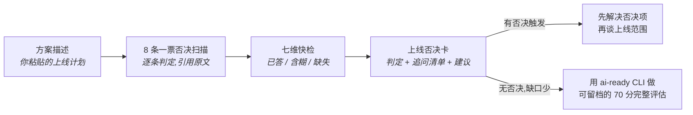

# AI 上线否决卡(ai-launch-red-team)


[English](README.en.md)

一个零代码的 Agent 技能:把"我们的 AI 准备上线了"的方案描述粘给它,它按 **8 条一票否决 + 七个维度**当场红队你,输出一张可以直接带进评审会的**上线否决卡**——哪条否决被触发、依据是方案里哪句原话、评审会上该追问什么。

它回答的问题只有一个:

> 演示跑通了。在它接触真实业务之前,还有哪些事没人想清楚?

## 30 秒安装

```bash
# Claude Code
git clone https://github.com/Anonymousyz/ai-launch-red-team.git ~/.claude/skills/ai-launch-red-team

# Cursor
git clone https://github.com/Anonymousyz/ai-launch-red-team.git ~/.cursor/skills/ai-launch-red-team

# Codex
git clone https://github.com/Anonymousyz/ai-launch-red-team.git ~/.codex/skills/ai-launch-red-team
```

Windows 把 `~` 换成 `%USERPROFILE%`。也可以直接下载 ZIP,把文件夹放进对应的 skills 目录。

## 怎么用

安装后直接描述需求即可触发,例如:

```text
用上线否决卡红队一下这个方案:
我们做了个客服退款 Agent,用大模型处理用户退款请求,准确率测过 95%,
可以自动执行退款,下周对全部用户上线,监控后面再补。
```

30 秒后你会得到一张否决卡:

- **一票否决扫描表**:8 条逐一判定【触发 / 存疑 / 未触发】,每条判定引用你方案里的原话;
- **七维快检**:业务价值、数据边界、质量评估、人工复核、日志审计、运维成本、组织采纳,逐项标【已答 / 含糊 / 缺失】;
- **追问清单**:按风险排序、可以直接在评审会上提的问题;
- **红队建议**:先做什么才有资格谈上线。

上面那个方案会被拦下两条否决:"自动执行退款"(高风险决策无人工复核)和"监控后面再补"(无差错处理或回滚负责人)。完整输出见 [examples/01-refund-agent.md](examples/01-refund-agent.md)。

## 评审逻辑



8 条否决与七个维度来自 [AI Prototype-to-Production Toolkit](https://github.com/Anonymousyz/ai-prototype-to-production-toolkit) 的固定评审契约:未经授权使用数据、敏感数据进入未批准的模型、高风险决策无人工复核、无日志或不可追溯、无差错处理或回滚负责人、输出质量无法评估、成本失控、演示冒充生产就绪。

## 三个示例

| 示例 | 演示什么 |
|---|---|
| [01 客服退款 Agent](examples/01-refund-agent.md) | 两条否决触发:资金动作无人复核、无回滚负责人 |
| [02 内部知识库助手](examples/02-kb-assistant.md) | 敏感数据流向未批准模型;授权与日志说不清 |
| [03 合同条款初筛](examples/03-controlled-pilot.md) | 无否决触发的干净方案长什么样,以及它仍然欠的三件事 |

## 它不做什么

- **不核实事实。**你说"有日志"它就按"声称有日志"处理,追问清单里会向你要证据。
- **不打分、不批准。**它给的是结构性缺口和印象判断。需要可留档、可复核、带报告的正式评估,用完整工具链:

| 你需要 | 去哪 |
|---|---|
| 70 分制 + 8 条否决的正式评估与 HTML 报告 | [ai-prototype-to-production-toolkit](https://github.com/Anonymousyz/ai-prototype-to-production-toolkit)(`ai-ready` CLI) |
| 把评估结果变成负责人能拍板的决策包 | [research-to-decision-toolkit](https://github.com/Anonymousyz/research-to-decision-toolkit)(`r2d` CLI) |
| 按缺口找评估/护栏/可观测等工具 | [awesome-ai-production-readiness](https://github.com/Anonymousyz/awesome-ai-production-readiness)(57 项经核验的目录) |

## 许可证

MIT,见 [LICENSE](LICENSE)。示例全部虚构,不含任何真实客户、雇主或运营数据。
